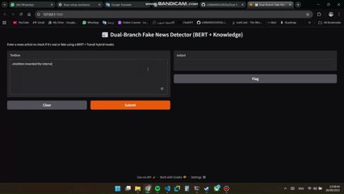

# 📰 Dual-Branch Fake News Detector (BERT + TransE)

[](#)
[](#)
[](#)
[](LICENSE)

> A practical research repo that detects fake news by **fusing** semantic text features (BERT) with **knowledge-graph** signals (TransE).

---

## 🌟 Highlights
- Dual-branch architecture: **Text (BERT)** + **Knowledge (TransE)** + **Fusion MLP**
- End-to-end pipeline: triplet extraction → KG embeddings → fusion
- Ready-to-run **GUI** (Gradio) and **reproducible notebooks**
- Public datasets supported (LIAR, FakeNewsNet)

---

## 📹 Demo


[](./Dual-Branch%20Fake%20News%20Detector%20(BERT%20+%20TransE).mp4)
<!-- If you make a GIF:  -->

---

## 📚 Table of Contents
- [Overview](#-overview)
- [Repo Structure](#-repo-structure)
- [Quickstart](#-quickstart)
- [Training & Evaluation](#-training--evaluation)
- [Results](#-results)
- [Paper](#-paper)
- [FAQ](#-faq)
- [Contributing](#-contributing)
- [License](#-license)
- [Authors & Supervision](#-authors--supervision)

---

## 🧭 Overview
This project combines **BERT** for language understanding with **TransE** to ground statements in a knowledge graph. We extract (head, relation, tail) triples, embed them, then **concatenate** `[CLS || knowledge]` and classify **FAKE/REAL**. See code and data layout below.  

---

## 🗂 Repo Structure
``` bash 
Data/
└─ liar_dataset/ (train.tsv, valid.tsv, test.tsv)
docs/
 ├── Internship_Report_0.1.pdf
 ├── Internship_Report_0.2.pdf
 ├── Internship_Report_0.3.pdf
 └─  Internship_Report_0.4.pdf
Figures/
└─ liar dataset visualization/ 
Models/
├─ checkpoints/ (bert_model_F1_.pt, fusion_model.pt, transe_model*.pt)
├─ tensors/ (cls_embeddings.pt, knowledge_tensor.pt, knowledge_vectors.pt)
└─ vocabs/ (entity_vocab.pt, relation_vocab.pt)
notebooks/
outputs/ (e.g., fusion_predictions.csv)
Paper/ (IEEE draft / source)
references/ (papers, thumbs, figures)
LICENSE
README.md
requirements.txt
```

---

## 🚀 Quickstart
```bash
# 1) Create env
python -m venv .venv
source .venv/bin/activate   # Windows: .venv\Scripts\activate

# 2) Install deps
pip install -r requirements.txt

# 3) (Optional) Put LIAR/FakeNewsNet in Data/
# 4) Run GUI
python notebooks/GUI/gui_fusion_demo.py  # or adjust path if different
```
Tip: install PyTorch per your CUDA from pytorch.org if needed.

markdown
## 🧪 Training & Evaluation
**BERT branch**
- `notebooks/BERT_training/train_bert_text_branch.ipynb` — fine-tune BERT

**Knowledge branch (TransE)**
- `notebooks/TransE_training/aggregate_triplets.ipynb` — build/article triplets
- `notebooks/TransE_training/build_transe_dataset.py` — build entity/relation vocabs
- `notebooks/TransE_training/train_transe_knowledge_branch.ipynb` — train TransE

**Fusion**
- `notebooks/Fusion_model/fuse_text_knowledge.ipynb` — fuse `[CLS || KG]`
- `notebooks/Fusion_model/fusion_inference.ipynb` — evaluate and export predictions (e.g., `outputs/fusion_predictions.csv`)

---

## 📈 Results

| Dataset      | Model              | Acc. | F1   |val_loss
|--------------|--------------------|-----:|-----:|---------:
| LIAR         | BERT (text only)   |  0.6425    |  0.6797   | —
| LIAR         | TransE (KG only)   |  —   |  —  | 0.3785
| LIAR         | **Fusion (Ours)**  |  0.6339    |  0.7715   | —

<!-- **Ablations:** add rows for pooling choice, KG size, extractor confidence, etc.  
**Qualitative examples:** optional table with an article snippet + top triples + prediction. -->

---
## 📊 Sample Results

Here are example predictions from our **Dual-Branch Fake News Detection Framework** (BERT text branch + TransE knowledge branch + Fusion):

| Text Example                                                                 | Predicted Label |
|------------------------------------------------------------------------------|-----------------|
| "COVID-19 can be cured by drinking bleach."                                  | ❌ Fake          |
| "NASA confirms discovery of water on the moon."                              | ✅ Real          |
| "The Eiffel Tower is located in Berlin."                                     | ❌ Fake          |
| "The Prime Minister announced new climate policies in today’s speech."       | ✅ Real          |

---

## 📝 Paper
- Draft: `Paper/Dual_Branch_Fake_News_Detection_Framework.pdf`
- Template: IEEE conference format  
- Overleaf: paste our LaTeX (see `Paper/`) and replace template text

---

## ❓ FAQ
**Q: Why TransE over RotatE/ComplEx?**  
A: TransE is simple, fast, and works well for this fusion baseline. RotatE/ComplEx are great drop-in upgrades.

**Q: What if triple extraction is noisy?**  
A: Use confidence thresholds and filter relations; the fusion still benefits from partial KG signal.

**Q: Can I run without a GPU?**  
A: Yes for inference/GUI; training BERT/TransE is much faster on GPU.

---

## 🤝 Contributing
Issues and PRs are welcome. Please:
- run notebooks with clear cell order
- add docstrings / comments
- avoid committing large raw datasets (they’re git-ignored)

---

## 📄 License
MIT — see [LICENSE](LICENSE).

---

## 👨‍🎓 Authors & Supervision
- **Author:** Mohamed Ahmed Mansour Mahmoud  
- **Under the supervision of:** Professor Ramakrishna